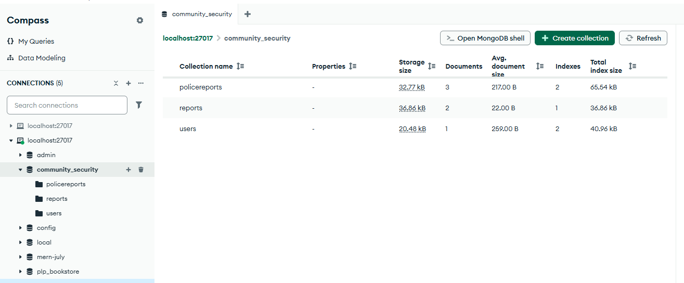

//The link for the app https://securityjuja.netlify.app/

//The Screenshot for the MongoDB Compass

Community Security Reporting System
📋 Overview
The Community Security Reporting System is a comprehensive web application designed to empower communities by providing a platform for reporting security concerns, identifying potential danger zones, and facilitating communication between citizens, community leaders, and law enforcement agencies.

🎯 Purpose
This application bridges the gap between community members and authorities by creating an accessible, transparent, and efficient system for reporting and tracking security issues within neighborhoods and localities.

✨ Key Features
🔐 User Authentication & Roles
Citizen Registration & Login: Secure user accounts for community members
Role-based Access: Different permissions for citizens, chiefs, elders, and administrators
Profile Management: User profiles with location and contact information

📝 Security Reporting
Community Reports: Submit security concerns to community leaders (requires login)

Anonymous Reporting: Option to submit reports anonymously
Categorized Issues: Organized reporting for theft, violence, vandalism, suspicious activities, and hotspot identification
Urgency Levels: Priority classification (Low, Medium, High, Critical)

🚨 Police Reporting
Direct Police Contact: Immediate reporting to law enforcement
No Login Required: Quick access for urgent situations
Reference Numbers: Trackable report identifiers for follow-up
Status Tracking: Monitor investigation progress

📊 Community Awareness
Public Report Feed: View security issues in your area
Filtering Options: Search by category, location, and status
Real-time Updates: Stay informed about local security concerns
Hotspot Identification: Mark and avoid dangerous areas

👥 Community Leadership Features
Report Management: Chiefs and elders can update report status
Assignment System: Delegate issues to appropriate personnel
Progress Tracking: Monitor resolution of community concerns

🛠️ Technical Stack
Frontend
React 18 - Modern UI library
Vite - Fast build tool and development server

React Router - Client-side routing

Axios - HTTP client for API communication

Tailwind CSS - Utility-first CSS framework

Backend
Node.js - Runtime environment

Express.js - Web application framework

MongoDB - NoSQL database

Mongoose - MongoDB object modeling

JWT - JSON Web Tokens for authentication

Express Validator - Input validation middleware

Development Tools
ESLint - Code linting and quality

Nodemon - Development server auto-restart

CORS - Cross-origin resource sharing